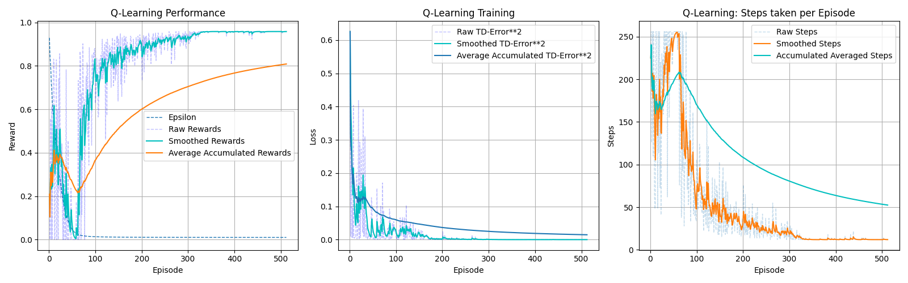
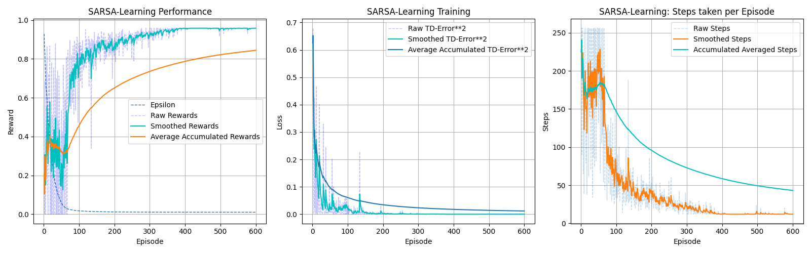
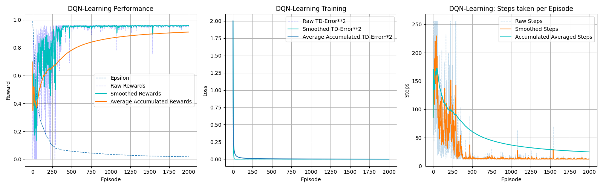
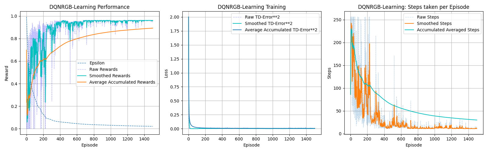

# REINFORCEMENT LEARNING
## TABULAR-METHODS
* SARSA
* Q-Learning
## DEEP-LEARNING TECHNIQUES
* Deep Q-Network
* Deep Q-Network, with image as input

# Dependencies
* ``Python3``
* ``PyTorch``
* ``Numpy``
* ``gymnasium``
* ``minigrid``
* ``pickle``
* ``torchinfo``

# How to
## Directories and scripts
* Utilty: Utility class and function
  * ``EpsilonStrategy`` and ``DQNEpsilonStrategy``: Helper class for $\epsilon$-Greedy and decresinag epsilon
  * ``MiniGrid``: Helper class for each use case of the minigrid:
    * ``MiniGridBase``: Defaults
    * ``MiniGridHash``: The observation become the MD5 hash of the observation
    * ``MiniGridRaw``: The observation become a normalized flattedend array
    * ``MiniGridImage``: The observation is the normalized grayscale of the partila observation
    * ``get_device``: a function that return ``mps``,  ``cuda`` or ``cpu`` depending on the plateform
  * ``ReplayMemory``: Contain the named Tuple ``Transition`` and a Class for the Replay Buffer
  * ``Plots``: Live training monitoring plots, and some helper function for the plots in ``Results.ipynb``
* ``Q_Learning``: Folder for Q-Learning algorithms
  * ``QLearning``: Main script/Module for Q-Learning
  * ``q_learning_table.pkl``: Optimal Q-table found using the Q-learning algorithm
* ``SARSA``: Folder for SARSA-Learning algorithms
  * ``SARSA``: Main script/Module for SARSA-Learning
  * ``sarsa_learning_table.pkl``: Optimal Q-table found using the SARSA-learning algorithm
* ``DQN``: Folder for Deep Q-Network approach
  * ``DQN``: Main scripts/Module for simple Deep Q-Network
  * ``dqn.pth``: Optimal weights of the policy netwok found using DQN
  * ``DQNIMAGE``: Main scripts/Module for CNN Deep Q-Network
  * ``dqn_image.pth``: Optimal weights of the policy netwok found using CNN-DQN

All the ``*_live_plot,json`` files contains the reward, td-error (squared, mse), steps taken per episod, thes value were
dynaicaly during training.

All the ``*_train.json`` files contains the reward, loss, steps take as a function of the steps done (global step).

Each Module/Script that correspond to a learning algorithn have a ``if __name__ == '__main__':``. It that section, 
we check if there is already a ``Q-table`` or ``Network Weight``, if so, we just evaluate, otherwise we train before evaluating.

The notebook ``Results.ipynb`` gather all the results, plots, performace of each algoriths. We can visualize the optimal
policy/path found by each algorthm, and we can use it if we want to check all evaluation result for each algorith.

**PS** The Live plot/monitoring during the training always take over all window during the training, we can close it without 
stoping the training if we want to perform other tasks.


# RESULTS
### Optimal Path found using Q-Learning


**SUMMARY**

|               | TRAIN  | EVALUATION |
|---------------|--------|------------|
|Episodes       | 512    | 1000       |
|Completion rate| 92.97% | 100%       |
|Average Reward | 0.808  | 0.958      |
|Average steps  | 52.510 | 12.000     |


### Optimal Path found using SARSA-Learning


**SUMMARY**

|               | TRAIN  | EVALUATION |
|---------------|--------|------------|
|Episodes       | 600    | 1000       |
|Completion rate| 95.67% | 100%       |
|Average Reward | 0.844  | 0.958      |
|Average steps  | 43.185 | 12.000     |


### Optimal Path found using DQN-Learning


**Network architecture**

```
==============================================================================
Layer (type:depth-idx)     Input Shape  Output Shape   Param #    Trainable
==============================================================================
DQN                        [1, 49]      [1, 3]         --         True
├─Sequential: 1-1          [1, 49]      [1, 3]         --         True
│    └─Linear: 2-1         [1, 49]      [1, 64]        3,200      True
│    └─ReLU: 2-2           [1, 64]      [1, 64]        --         --
│    └─Linear: 2-3         [1, 64]      [1, 32]        2,080      True
│    └─ReLU: 2-4           [1, 32]      [1, 32]        --         --
│    └─Linear: 2-5         [1, 32]      [1, 3]         99         True
==============================================================================
Total params: 5,379
Trainable params: 5,379
Non-trainable params: 0
Total mult-adds (M): 0.01
==============================================================================
Input size (MB): 0.00
Forward/backward pass size (MB): 0.00
Params size (MB): 0.02
Estimated Total Size (MB): 0.02
==============================================================================
```

**SUMMARY**

|               | TRAIN  | EVALUATION |
|---------------|--------|------------|
|Episodes       | 2000   | 1000       |
|Completion rate| 99.2%  | 100%       |
|Average Reward | 0.912  | 0.958      |
|Average steps  | 24.794 | 12.000     |


### Optimal Path found using DQN-Learning with RGB Image technique


**Network architecture**

```
=================================================================================================
Layer (type:depth-idx)       Input Shape      Kernel Shape  Output Shape     Param #  Trainable
=================================================================================================
CNN_DQN                      [1, 4, 56, 56]   --            [1, 3]           --       True
├─Sequential: 1-1            [1, 4, 56, 56]   --            [1, 512]         --       True
│    └─Conv2d: 2-1           [1, 4, 56, 56]   [3, 3]        [1, 16, 27, 27]  576      True
│    └─BatchNorm2d: 2-2      [1, 16, 27, 27]  --            [1, 16, 27, 27]  32       True
│    └─ReLU: 2-3             [1, 16, 27, 27]  --            [1, 16, 27, 27]  --       --
│    └─Conv2d: 2-4           [1, 16, 27, 27]  [3, 3]        [1, 32, 13, 13]  4,608    True
│    └─BatchNorm2d: 2-5      [1, 32, 13, 13]  --            [1, 32, 13, 13]  64       True
│    └─ReLU: 2-6             [1, 32, 13, 13]  --            [1, 32, 13, 13]  --       --
│    └─Conv2d: 2-7           [1, 32, 13, 13]  [3, 3]        [1, 64, 6, 6]    18,432   True
│    └─BatchNorm2d: 2-8      [1, 64, 6, 6]    --            [1, 64, 6, 6]    128      True
│    └─ReLU: 2-9             [1, 64, 6, 6]    --            [1, 64, 6, 6]    --       --
│    └─Conv2d: 2-10          [1, 64, 6, 6]    [3, 3]        [1, 128, 2, 2]   73,728   True
│    └─BatchNorm2d: 2-11     [1, 128, 2, 2]   --            [1, 128, 2, 2]   256      True
│    └─Flatten: 2-12         [1, 128, 2, 2]   --            [1, 512]         --       --
├─Sequential: 1-2            [1, 512]         --            [1, 3]           --       True
│    └─Linear: 2-13          [1, 512]         --            [1, 64]          32,832   True
│    └─ReLU: 2-14            [1, 64]          --            [1, 64]          --       --
│    └─Linear: 2-15          [1, 64]          --            [1, 3]           195      True
=================================================================================================
Total params: 130,851
Trainable params: 130,851
Non-trainable params: 0
Total mult-adds (M): 2.19
=================================================================================================
Input size (MB): 0.05
Forward/backward pass size (MB): 0.32
Params size (MB): 0.52
Estimated Total Size (MB): 0.89
=================================================================================================
```

**SUMMARY**

|               | TRAIN  | EVALUATION |
|---------------|--------|------------|
|Episodes       | 1500   | 1000       |
|Completion rate| 98%    | 100%       |
|Average Reward | 0.892  | 0.961      |
|Average steps  | 30.068 | 11.000     |


# TO DO
* Add docstring
* Improve code readability
* Error Handling
* Make the live plot compatible with Jupyter if possible
# REFERENCES
