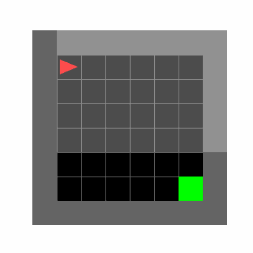

# Reinforcement Learning
## Overview
This project explores various reinforcement learning (RL) algorithms, both traditional and deep learning-based, 
to solve navigation tasks in a grid environment. The project implements and evaluates several RL methods, including
tabular approaches like Q-Learning and SARSA, as well as deep learning techniques such as Deep Q-Networks (DQN).
The performance of these algorithms is analyzed and compared based on their ability to learn optimal policies for 
navigating the grid.

### Tabular Methods:
* **Q-Learning**: A model-free RL algorithm that learns the value of actions in each state using a Q-table.
* **SARSA**: An on-policy RL algorithm that updates the Q-value based on the action performed in the current state.

### Deep Learning Techniques:
* **Deep Q-Network (DQN)**: Utilizes neural networks to approximate the Q-values for each state-action pair, enabling the handling of large state spaces.
* **DQN with Image Input**: Enhances DQN by incorporating image-based observations, using convolutional neural networks (CNNs) to process visual input.


## Dependencies
The scripts require the following dependencies to run;
- `Python3`
- `PyTorch`
- `Numpy`
- `gymnasium`
- `minigrid`
- `pickle`
- `torchinfo`
- `jupyter`
- 
### Directories and Scripts
#### Utility
- **EpsilonStrategy** and **DQNEpsilonStrategy**: Helper classes for $\epsilon$-Greedy and decreasing epsilon strategies.
- **MiniGrid**: Helper classes for various use cases of the mini-grid:
  - **MiniGridBase**: Defaults
  - **MiniGridHash**: Observation becomes the MD5 hash of the observation
  - **MiniGridRaw**: Observation becomes a normalized, flattened array
  - **MiniGridImage**: Observation is the normalized grayscale of the partial observation
- **get_device**: Function that returns `mps`, `cuda`, or `cpu` depending on the platform.
- **ReplayMemory**: Contains the named tuple `Transition` and a class for the Replay Buffer.
- **Plots**: Live training monitoring plots and helper functions for the plots in `Results.ipynb`.

#### Q_Learning
- **QLearning**: Main script/module for Q-Learning
- **q_learning_table.pkl**: Optimal Q-table found using the Q-learning algorithm

#### SARSA
- **SARSA**: Main script/module for SARSA-Learning
- **sarsa_learning_table.pkl**: Optimal Q-table found using the SARSA-learning algorithm

#### DQN
- **DQN**: Main script/module for simple Deep Q-Network
- **dqn.pth**: Optimal weights of the policy network found using DQN
- **DQNIMAGE**: Main script/module for CNN Deep Q-Network
- **dqn_image.pth**: Optimal weights of the policy network found using CNN-DQN

#### Logs and Results
- All `*_live_plot.json` files contain the reward, TD-error (squared, MSE), and steps taken per episode, recorded dynamically during training.
- All `*_train.json` files contain the reward, loss, and steps taken as a function of the steps done (global step).

### Execution
Each module/script corresponding to a learning algorithm has a `if __name__ == '__main__':` block. In this section:
- If a `Q-table` or `Network Weight` already exists, it evaluates the model.
- Otherwise, it trains the model before evaluating.

### Results Notebook
- **Results.ipynb**: Gathers all results, plots, and performance metrics of each algorithm. Visualize the optimal policy/path found by each algorithm and check all evaluation results.

**Note**: The live plot/monitoring during training always takes over all windows. You can close it without stopping the training if you want to perform other tasks.

# Results

### Optimal Path Found Using Q-Learning


**Summary**

|               | Train  | Evaluation |
|---------------|--------|------------|
|Episodes       | 512    | 1000       |
|Completion Rate| 92.97% | 100%       |
|Average Reward | 0.808  | 0.958      |
|Average Steps  | 52.510 | 12.000     |


### Optimal Path Found Using SARSA-Learning


**Summary**

|               | Train  | Evaluation |
|---------------|--------|------------|
|Episodes       | 600    | 1000       |
|Completion Rate| 95.67% | 100%       |
|Average Reward | 0.844  | 0.958      |
|Average Steps  | 43.185 | 12.000     |


### Optimal Path Found Using DQN-Learning


**Network Architecture**

```
==============================================================================
Layer (type:depth-idx)     Input Shape  Output Shape   Param #    Trainable
==============================================================================
DQN                        [1, 49]      [1, 3]         --         True
├─Sequential: 1-1          [1, 49]      [1, 3]         --         True
│    └─Linear: 2-1         [1, 49]      [1, 64]        3,200      True
│    └─ReLU: 2-2           [1, 64]      [1, 64]        --         --
│    └─Linear: 2-3         [1, 64]      [1, 32]        2,080      True
│    └─ReLU: 2-4           [1, 32]      [1, 32]        --         --
│    └─Linear: 2-5         [1, 32]      [1, 3]         99         True
==============================================================================
Total params: 5,379
Trainable params: 5,379
Non-trainable params: 0
Total mult-adds (M): 0.01
==============================================================================
Input size (MB): 0.00
Forward/backward pass size (MB): 0.00
Params size (MB): 0.02
Estimated Total Size (MB): 0.02
==============================================================================
```

**Summary**

|               | Train  | Evaluation |
|---------------|--------|------------|
|Episodes       | 2000   | 1000       |
|Completion Rate| 99.2%  | 100%       |
|Average Reward | 0.912  | 0.958      |
|Average Steps  | 24.794 | 12.000     |


### Optimal Path Found Using DQN-Learning with RGB Image Technique


**Network Architecture**

```
=================================================================================================
Layer (type:depth-idx)       Input Shape      Kernel Shape  Output Shape     Param #  Trainable
=================================================================================================
CNN_DQN                      [1, 4, 56, 56]   --            [1, 3]           --       True
├─Sequential: 1-1            [1, 4, 56, 56]   --            [1, 512]         --       True
│    └─Conv2d: 2-1           [1, 4, 56, 56]   [3, 3]        [1, 16, 27, 27]  576      True
│    └─BatchNorm2d: 2-2      [1, 16, 27, 27]  --            [1, 16, 27, 27]  32       True
│    └─ReLU: 2-3             [1, 16, 27, 27]  --            [1, 16, 27, 27]  --       --
│    └─Conv2d: 2-4           [1, 16, 27, 27]  [3, 3]        [1, 32, 13, 13]  4,608    True
│    └─BatchNorm2d: 2-5      [1, 32, 13, 13]  --            [1, 32, 13, 13]  64       True
│    └─ReLU: 2-6             [1, 32, 13, 13]  --            [1, 32, 13, 13]  --       --
│    └─Conv2d: 2-7           [1, 32, 13, 13]  [3, 3]        [1, 64, 6, 6]    18,432   True
│    └─BatchNorm2d: 2-8      [1, 64, 6, 6]    --            [1, 64, 6, 6]    128      True
│    └─ReLU: 2-9             [1, 64, 6, 6]    --            [1, 64, 6, 6]    --       --
│    └─Conv2d: 2-10          [1, 64, 6, 6]    [3, 3]        [1, 128, 2, 2]   73,728   True
│    └─BatchNorm2d: 2-11     [1, 128, 2, 2]   --            [1, 128, 2, 2]   256      True
│    └─Flatten: 2-12         [1, 128, 2, 2]   --            [1, 512]         --       --
├─Sequential: 1-2            [1, 512]         --            [1, 3]           --       True
│    └─Linear: 2-13          [1, 512]         --            [1, 64]          32,832   True
│    └─ReLU: 2-14            [1, 64]          --            [1, 64]          --       --
│    └─Linear: 2-15          [1, 64]          --            [1, 3]           195      True
=================================================================================================
Total params: 130,851
Trainable params: 130,851
Non-trainable params: 0
Total mult-adds (M): 2.19
=================================================================================================
Input size (MB): 0.05
Forward/backward pass size (MB): 0.32
Params size (MB): 0.52
Estimated Total Size (MB): 0.89
=================================================================================================
```

**Summary**

|               | Train  | Evaluation |
|---------------|--------|------------|
|Episodes       | 1500   | 1000       |
|Completion Rate| 98%    | 100%       |
|Average Reward | 0.892  | 0.961      |
|Average Steps  | 30.068 | 11.000     |



# To Do
- Add docstrings
- Improve code readability
- Error Handling
- Make the live plot compatible with Jupyter if possible

# References
* Prof Herman Engelbrecht, Reinforcement Learning Lecture, Stellenbosch University, 2024.
* Richard S. Sutton, Andrew Barto, Reinforcement Learning: An Introduction.
* Farama Foundation, _minigrid_, [https://minigrid.farama.org/]() 